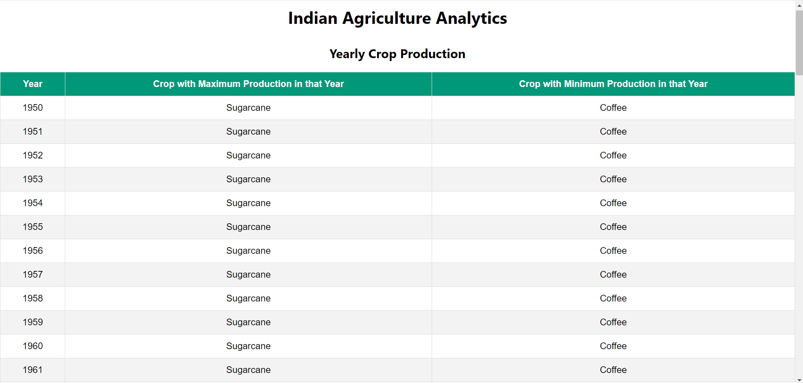
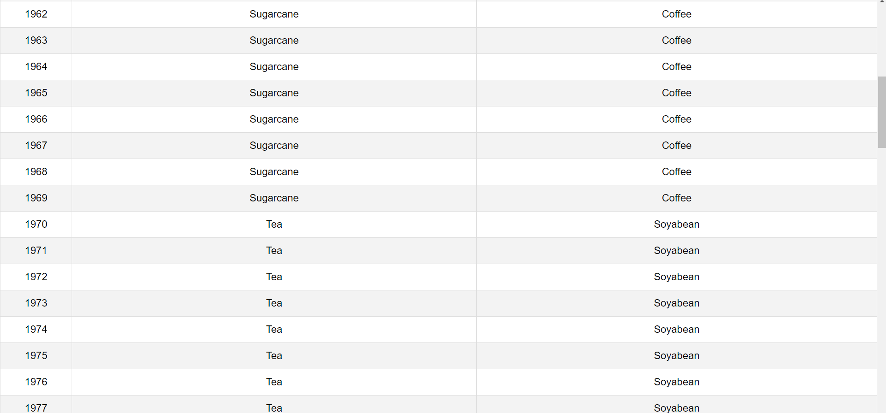
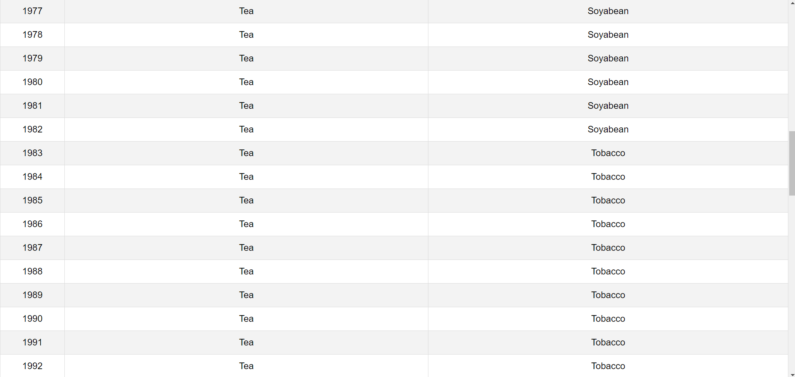
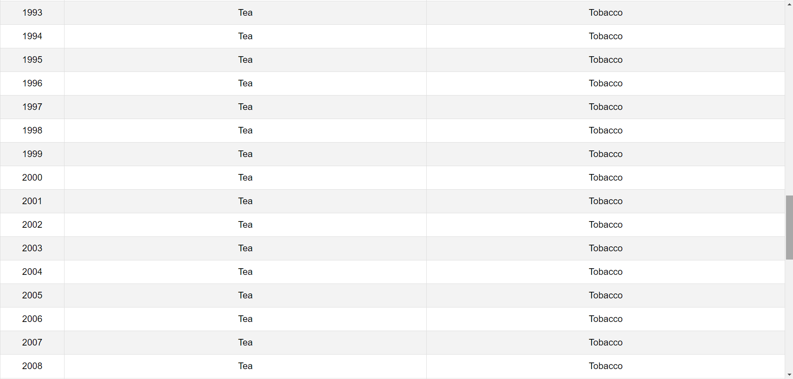
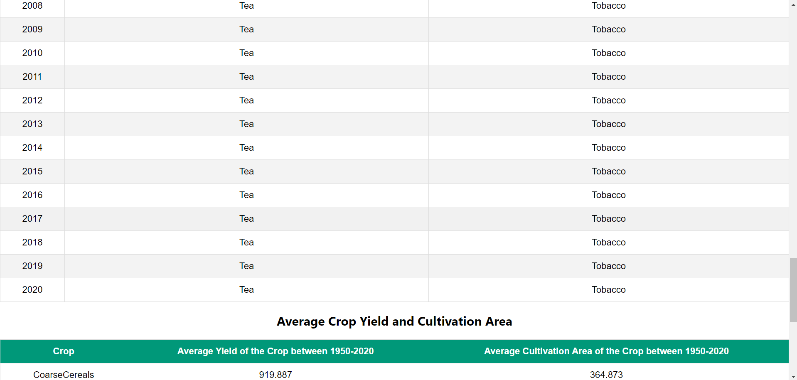
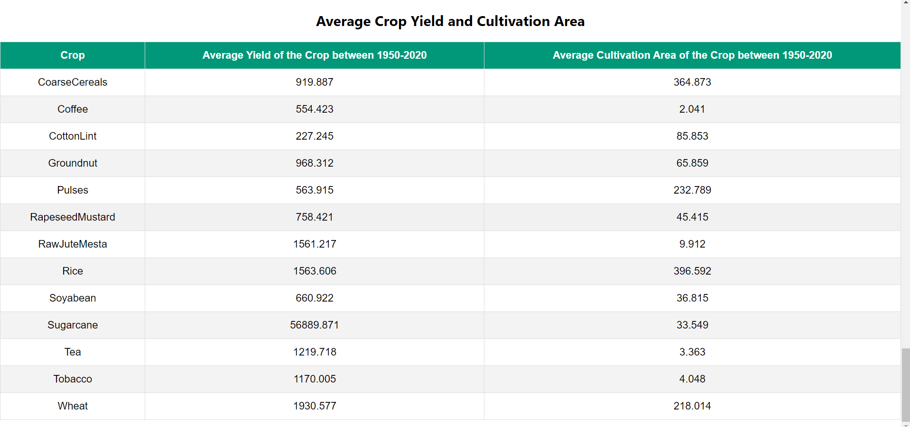

# Indian Agriculture Data Analysis

Project Link : https://manufac-analytics-sde-assignment-cuve.netlify.app/
This project performs data analysis on the Indian Agriculture dataset provided by the National Data and Analytics Platform (NITI Aayog) and displays the results in tables using React and Mantine.

## Prerequisites

Make sure you have the following installed on your machine:

- Node.js (v14 or above)
- Yarn

## Getting Started

Follow these steps to get the application up and running:

1. **Clone the Repository:**

    ```bash
    git clone https://github.com/your-username/indian-agriculture-data-analysis.git
    cd indian-agriculture-data-analysis
    ```

2. **Install Dependencies:**

    ```bash
    yarn install
    ```

3. **Start the Application:**

    ```bash
    yarn start
    ```

    This will start the development server and automatically open the application in your default web browser. If it doesn't open automatically, you can manually navigate to `http://localhost:3000`.
## Features

- Displays yearly crop production data with maximum and minimum production crops for each year.
- Displays average yield and cultivation area for each crop between 1950-2020.
- Data is processed and displayed using Mantine components.
- No external libraries like Bootstrap, jQuery, or Lodash are used.
- Uses Yarn for package management.

## Technologies Used

- TypeScript
- React (via Create React App)
- Yarn
- Mantine v7


## Project Structure

- `src/`
  - `components/`
    - `CropTable.tsx` - Component for displaying crop average yield and cultivation area.
    - `YearlyTable.tsx` - Component for displaying yearly crop production data.
  - `data/`
    - `agricultureData.json` - The dataset used for analysis.
  - `utils/`
    - `dataProcessor.ts` - Contains functions for processing the dataset.
  - `App.tsx` - The main application component.
  - `index.tsx` - Entry point for the React application.
  - `index.css` - Global CSS styles.

## Code Explanation

### `App.tsx`

The main application component that:

- Imports the dataset from `agricultureData.json`.
- Uses `useEffect` to process the data using `processAgricultureData`.
- Sets the processed data in state variables.
- Passes the data to `YearlyTable` and `CropTable` components for rendering.

### `dataProcessor.ts`

Contains the `processAgricultureData` function that processes the dataset to:

- Aggregate yearly crop production data.
- Calculate average yield and cultivation area for each crop.

### `YearlyTable.tsx` and `CropTable.tsx`

Components that receive processed data as props and render it in tables using Mantine components.

## Screenshots

Here are screenshots of the tables displayed by the application:

### Yearly Crop Production Table

# Screenshots

<p align="center">
  
  
  
  
  
</p>


### Average Crop Yield and Cultivation Area Table




### Note:

This is simple UI. Using simple css it can be converted into great user interactive.
